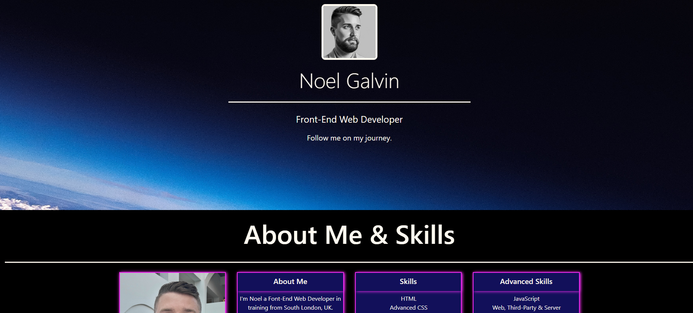

# Noel Galvin Bootstrap-Portfolio

Here is the deployed website link:
https://ngalvin1991.github.io/Bootstrap-Portfolio/

## Description
The purpose of this challenge was to create a portfolio web page using Bootstrap (4.6) components. The reason behind this is to showcase my work to future employers to show them the skills that I have learnt throughout my time as a Front-End Web Developer. 

The following Bootstrap components were required to develop the porfolio web page (I have provided some examples below):

A Navigation menu:
        

A Jumbotron:

Bootstrap Cards - Which was used for 'My Work' section: 

The web page was also had to minimise media queries. 

## Installation

N/A 

## Usage

The page was to function correctly for example all nav bar links were to link to the specific sections on the page, while all other links were to have a hover effect as per the example below:

The HTML and CSS were to flow accordingly as per the website so that the viewer could understand the layout of the website, I have provided an example below:

HTML example: 

CSS example: 

HTML web page flow: 

Deployed web page flow: 

In regards to media queries, these were kept to a minimum but were required for smaller screens, see example below: 

Media Query example:

## Credits

Here are some useful links that assisted the completion of this project: 

https://getbootstrap.com/docs/4.6/getting-started/introduction/

https://www.w3schools.com/

https://developer.mozilla.org/

## License 

GNU GENERAL PUBLIC LICENSE, Version 3, 29 June 2007